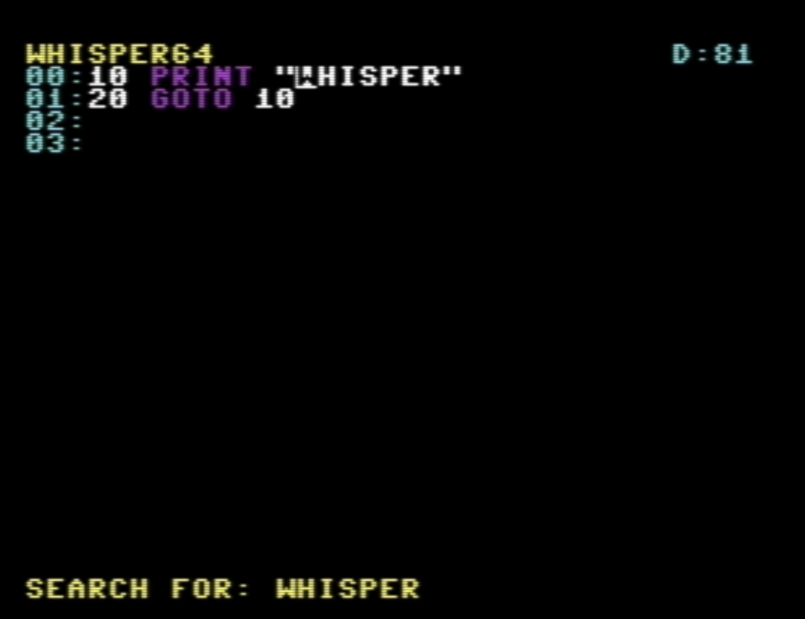

# Whisper64 🐕
A feature-rich text editor for the Commodore 64.



## Features

- **BASIC Mode** with keyword syntax highlighting and automatic line renumbering
- **Smart Paging**: 256-line capacity with automatic 64-line pages
- **Directory Browser**: Multi-drive support (8-15) with file type display
- **Search & Replace**: Find text with wrap-around and replace all
- **Copy/Paste**: Visual mark mode for selecting and copying text
- **Status Bar**: Shows filename, cursor position, drive, page, and mode indicators
- **37×23 editing area** with line numbers

## Installation

### Prerequisites
Install the [LLVM-MOS SDK](https://github.com/llvm-mos/llvm-mos-sdk#getting-started)

### Building
```bash
mkdir build
cd build
cmake ..
cmake --build .
```

The compiled program will be at `build/whisper64.prg`

### Running
Load on your C64 or emulator:
```
LOAD "WHISPER64.PRG",8,1
RUN
```

## Key Commands

| Key | Function |
|-----|----------|
| **F1** | Load file (opens directory browser) |
| **F2** | Save file (with overwrite protection) |
| **F3** | Select drive (8-15) |
| **F4** | Toggle BASIC mode / Renumber BASIC lines |
| **F5** | Find text |
| **F6** | Find & replace (with replace all option) |
| **F7** | Find next occurrence |
| **F8** | Help screen |
| **CTRL+M** | Toggle mark mode for selection |
| **CTRL+C** | Copy marked text (up to 8 lines) |
| **CTRL+V** | Paste copied text |
| **HOME** | Go to top of file |
| **Arrows** | Move cursor (updates mark selection when active) |

## BASIC Mode

Press **F4** to enable BASIC mode, which provides:
- Purple keyword highlighting for BASIC commands
- Press **F4** again to renumber all lines (10, 20, 30...)
- Automatic update of GOTO, GOSUB, THEN, and ELSE references
- Line number display in cyan

## Directory Browser

Press **F1** to open the directory browser:
- Shows disk name at top
- Displays file type (PRG, SEQ, DEL, USR, REL)
- Shows locked files with asterisk (*)
- Displays block size for each file
- Use **↑/↓** arrows to navigate
- Press **RETURN** to load selected file
- Press **RUN/STOP** to cancel

## Status Bar

The top status bar displays:
- **Filename**: Currently loaded/saved file (8 chars)
- **Line:Column**: Current cursor position
- **[BAS]**: BASIC mode indicator (purple)
- **[M]**: Mark mode active indicator (green)
- **D:n**: Current drive number (cyan)
- **Pn/n**: Current page / total pages (cyan, if multi-page)

## Copy/Paste Operations

To copy and paste text:
1. Press **CTRL+M** to enter mark mode
2. Use arrow keys to select text (selection shown in yellow)
3. Press **CTRL+C** to copy the selected text
4. Move cursor to destination
5. Press **CTRL+V** to paste
6. Press **CTRL+M** again to exit mark mode

You can copy up to 8 lines at once. The copied text remains in the clipboard until you copy something new.

## Search & Replace

**Simple Search:**
1. Press **F5** to open search
2. Type the search term and press RETURN
3. Use **F7** to find next occurrence
4. Search wraps around to beginning when reaching end

**Find & Replace:**
1. First search with **F5**
2. Press **F6** to open replace dialog
3. Type replacement text
4. Choose:
   - **Y** to replace all occurrences at once
   - **N** to manually replace each occurrence
## License
Free to use and modify.