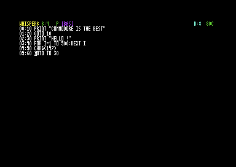

# Whisper64
A text editor for the Commodore 64.



## Features

- **80-Column Mode**: Bitmap-based 80-column display using a 4x8 pixel font (toggle with CTRL+D)
- **REU Support**: RAM Expansion Unit for fast page swapping (auto-detected, up to 16MB)
- **BASIC Mode** with keyword syntax highlighting and automatic line renumbering
- **Multi-Page Editing**: Pages stored in REU or disk temp files
- **Directory Browser**: Multi-drive support (8-15) with file type display
- **Search & Replace**: Find text with wrap-around and replace all
- **Copy/Paste**: Visual mark mode for selecting and copying text
- **Undo/Redo**: One-level undo and redo
- **Goto Line**: Jump to any line number
- **Mouse Support**: 1351 mouse on Control Port 1
- **40-column mode**: 37x23 editing area with line numbers
- **80-column mode**: 77x23 editing area with line numbers

## Prerequisites

Install the [LLVM-MOS SDK](https://github.com/llvm-mos/llvm-mos-sdk):
```bash
# macOS (Apple Silicon)
curl -sL https://github.com/llvm-mos/llvm-mos-sdk/releases/latest/download/llvm-mos-macos.tar.xz -o /tmp/llvm-mos.tar.xz
mkdir -p ~/llvm-mos && tar -xf /tmp/llvm-mos.tar.xz -C ~/llvm-mos --strip-components=1
```

## Building

```bash
mkdir build && cd build
cmake -DCMAKE_PREFIX_PATH=~/llvm-mos ..
make
```

Output: `build/whisper64.prg`

A 512KB REU image (`whisper64.reu`) and a blank D64 disk image (`whisper64.d64`) are created automatically during the build.

## Running

### VICE Emulator

```bash
./run_vice.sh
```

This launches VICE (x64sc) with REU enabled and a D64 disk image attached to drive 8.

### Real Hardware

Transfer `whisper64.prg` to a disk or SD card and load:
```
LOAD "WHISPER64",8,1
RUN
```

For REU support, ensure the REU is connected before starting.

## Key Commands

| Key | Function |
|-----|----------|
| **F1** | Load file (directory browser) |
| **F2** | Save file |
| **F3** | Select drive (8-15) |
| **F4** | Toggle BASIC mode / Renumber lines |
| **F5** | Find text |
| **F6** | Find & replace |
| **F7** | Find next |
| **F8** | Help screen |
| **CTRL+C** | Copy marked text |
| **CTRL+D** | Toggle 40/80 column mode |
| **CTRL+G** | Goto line |
| **CTRL+J** | Toggle mouse on/off |
| **CTRL+K** | Toggle mark mode |
| **CTRL+V** | Paste text |
| **CTRL+W** | New file (clear buffer) |
| **CTRL+Y** | Redo |
| **CTRL+Z** | Undo |
| **HOME** | Go to start of file |
| **Arrows** | Move cursor |

## 80-Column Mode

Press **CTRL+D** to toggle between 40 and 80 column modes.

80-column mode uses VIC-II hires bitmap mode with a 4x8 pixel font (SCREEN-80 from Compute's Gazette, 1984). The display is rendered in VIC bank 3 ($C000-$FFFF) with bitmap data at $E000 and video matrix at $D800.

Limitations:
- Each pair of adjacent characters shares one foreground color
- Slower screen updates than 40-column mode (typing updates only the current line for speed)

## REU Support

The editor auto-detects REU at startup and shows the available size and maximum page count. With REU, page swapping is instant (DMA transfer) instead of using slow disk temp files.

Page capacity depends on REU size:
- 256KB: ~66 pages
- 512KB: ~136 pages

All pages are saved to and loaded from REU when switching pages. File save (F2) writes all pages to disk. File load (F1) reads the file and distributes content across pages as needed.

## BASIC Mode

Press **F4** to enable BASIC mode:
- Keyword highlighting in purple
- Press **F4** again to renumber lines (10, 20, 30...)
- Updates GOTO, GOSUB, THEN, and ELSE references automatically

## Directory Browser

Press **F1** to open:
- Shows disk name, file types (PRG, SEQ, DEL, USR, REL), block sizes
- **UP/DOWN** to navigate, **RETURN** to load, **RUN/STOP** to cancel

## License

Free to use and modify.
